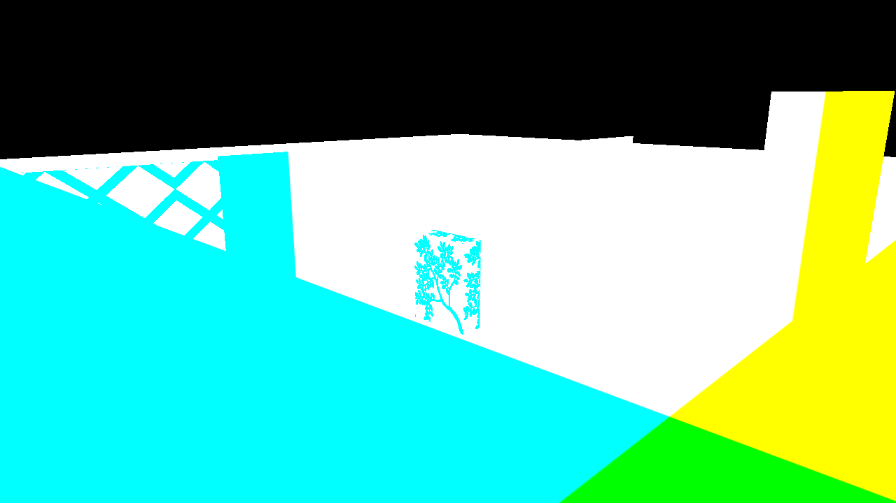
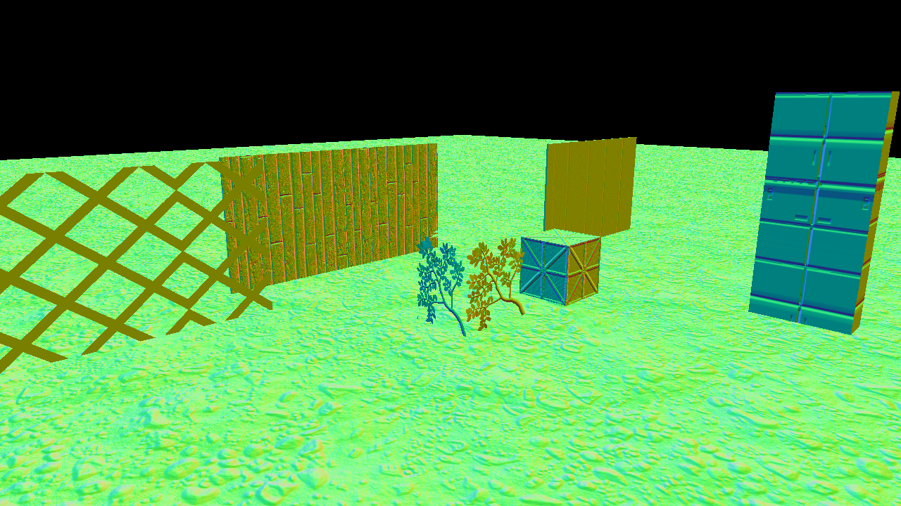
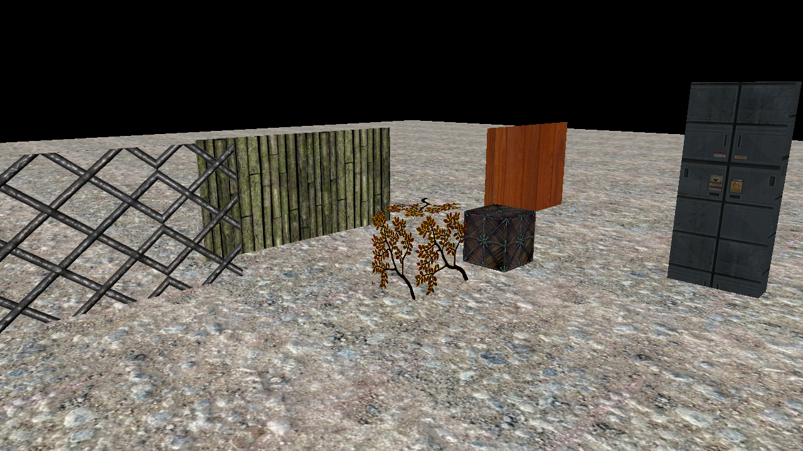
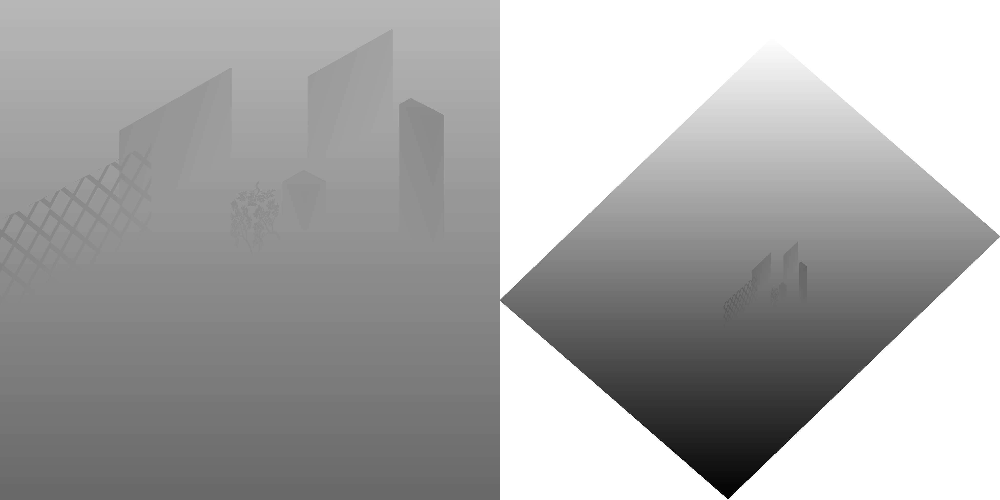
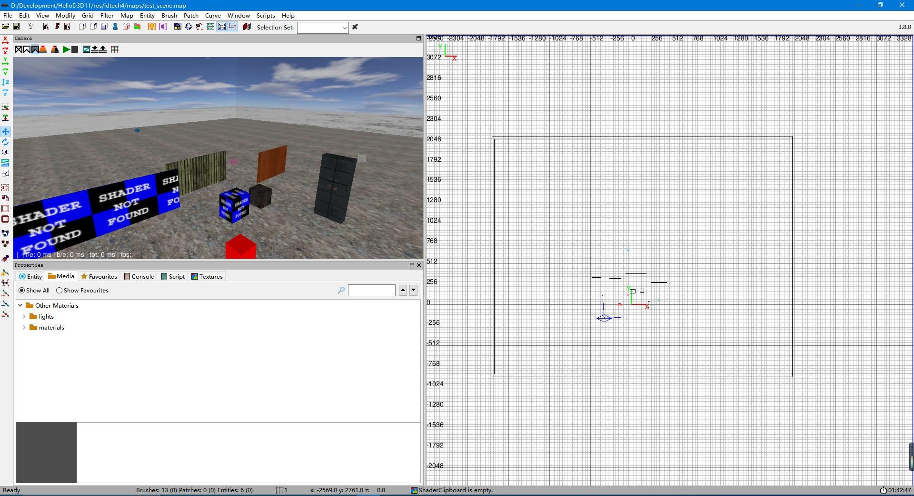

# HelloD3D11
从23年2月份开始，编学C++边阅读《Introduction to 3D Game Programming with DirectX 11》做的一个简易的渲染器，主要用于练习。

到目前为止：

1、实现了一个基本的延迟着色管线。

2、目前仅支持平行光、点光源和聚光灯。

3、实现了平行光CascadeShadowMap，点光源和聚光灯还未做阴影。

4、由于使用DarkRadiant作为场景编辑器，所以做一个了Doom3场景文件(.map、.proc)加载器。

5、制定了一个简易的材质文件格式。

6、目前仅支持加载.obj格式网格（使用tinyobjloader）和书中定义的文本格式网格。

7、基于Effect系统实现简单的Shader管理。

8、仿照Unity绘制一个三角形（非Quad）进行屏幕Blit。

9、使用XNACollision（xnacollision.h、xnacollision.cpp）做视锥剔除。

10、使用DirectX内置接口加载DDS纹理，其余格式图像使用stb_image.h加载。

11、数学库使用XNAMath。

### Building

建议使用VS2019编译项目

GBuffer0 （RGB通道存世界坐标，A通道存SpecularPower）

GBuffer1 （RGB通道存Normal，A通过存是否接受阴影的标志位）

GBuffer02 (Albdeo)

GBuffer4 (暂时未使用，后面准备存高光数据)

平行光CascadeShadowMap

DrakRadiant

开源3D游戏项目TheDrakMod所使用的场景编辑器。TheDrakMod是基于Doom3引擎开发的，包括DarkRadiant也是基于Doom3的场景编辑器Radiant改进而来的。相对于原版的Radiant，DrakRadiant操作上更为方便一些，并且支持连接游戏进程实时修改场景。

